# Fluxogramas de Usuário — Comunidade AUVP

Fluxogramas visuais dos fluxos descritos na seção **7. Fluxos de Usuário e Jornadas
Principais** da Tech Spec. Gerados com [Mermaid](https://mermaid.js.org/), usando as
cores do Design System AUVP (verde institucional `#023619` / amarelo `#EFBE4F`).

Os arquivos-fonte (`.mmd`) ficam em [`docs/fluxogramas/`](./fluxogramas) — edite-os e
regenere as imagens com `mmdc` (Mermaid CLI) sempre que o fluxo mudar. Os `.svg` (vetor,
ideal para documentação) e `.png` (preview rápido) também ficam nessa pasta.

---

## 7.1 Fluxos do Aluno (Interface Social)

### Fluxo 1 — Consumo e Descoberta de Conteúdo (Feed e Busca)

### Fluxo 2 — Criação de Postagem e Validação

### Fluxo 3 — Gestão de Perfil e Gamificação

### Fluxo 4 — Conexão e Mensagem Privada (DMs)

---

## 7.2 Fluxos Operacionais (Painel do Moderador)

### Fluxo Operacional A — Processamento de Denúncia Abusiva (Integração Blip)

### Fluxo Operacional B — Auditoria Antifraude de Apelido

